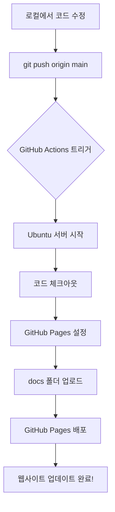

# GitHub Actions 워크플로우 완벽 가이드 📚

## 목차
1. [GitHub Actions란?](#github-actions란)
2. [deploy.yml 파일 완전 분석](#deployyml-파일-완전-분석)
3. [작동 원리 시각화](#작동-원리-시각화)
4. [실전 사용법](#실전-사용법)
5. [문제 해결](#문제-해결)

---

## GitHub Actions란?

**GitHub Actions**는 GitHub에서 제공하는 **무료 자동화 도구**입니다.

### 🤔 왜 필요한가요?

웹사이트를 만들었다고 상상해보세요. 코드를 수정할 때마다:
1. 로컬에서 코드 수정
2. Git에 커밋
3. GitHub에 푸시
4. 서버에 접속해서 파일 업로드
5. 웹사이트 재시작

**너무 귀찮죠?** 😫

GitHub Actions를 사용하면:
1. 로컬에서 코드 수정
2. Git에 커밋 & 푸시
3. **끝!** ✨ (나머지는 자동으로!)

---

## deploy.yml 파일 완전 분석

우리 프로젝트의 `.github/workflows/deploy.yml` 파일을 한 줄씩 분석해봅시다.

### 📄 전체 코드

```yaml
name: Deploy to GitHub Pages

on:
  push:
    branches:
      - main
  workflow_dispatch:

permissions:
  contents: read
  pages: write
  id-token: write

concurrency:
  group: "pages"
  cancel-in-progress: false

jobs:
  deploy:
    environment:
      name: github-pages
      url: ${{ steps.deployment.outputs.page_url }}
    runs-on: ubuntu-latest
    steps:
      - name: Checkout
        uses: actions/checkout@v4
      
      - name: Setup Pages
        uses: actions/configure-pages@v4
      
      - name: Upload artifact
        uses: actions/upload-pages-artifact@v3
        with:
          path: './docs'
      
      - name: Deploy to GitHub Pages
        id: deployment
        uses: actions/deploy-pages@v4
```

---

### 🔍 라인별 상세 설명

#### 1. 워크플로우 이름 설정

```yaml
name: Deploy to GitHub Pages
```

**설명**: 
- 이 자동화 작업의 이름입니다
- GitHub의 "Actions" 탭에서 이 이름으로 표시됩니다
- 원하는 대로 변경 가능 (예: "자동 배포", "웹사이트 업데이트")

**비유**: 
- 레시피 이름 같은 것 (예: "김치찌개 만들기")

---

#### 2. 트리거 조건 (언제 실행할까?)

```yaml
on:
  push:
    branches:
      - main
  workflow_dispatch:
```

**설명**:
- `on`: "언제 이 작업을 실행할까?"를 정의
- `push`: Git 푸시가 발생했을 때
- `branches: - main`: main 브랜치에 푸시했을 때만
- `workflow_dispatch`: GitHub 웹사이트에서 수동으로 실행 버튼 클릭 가능

**비유**:
- 알람 설정 같은 것
  - `push`: "매일 아침 7시에 울려라" (자동)
  - `workflow_dispatch`: "내가 버튼 누르면 울려라" (수동)

**예시 시나리오**:
```bash
# 로컬에서 작업
git add .
git commit -m "홈페이지 수정"
git push origin main  # ← 이 순간 워크플로우 자동 실행!
```

---

#### 3. 권한 설정

```yaml
permissions:
  contents: read      # 코드 읽기 권한
  pages: write        # GitHub Pages에 쓰기 권한
  id-token: write     # 인증 토큰 생성 권한
```

**설명**:
- GitHub Actions가 우리 저장소에서 할 수 있는 일을 제한
- 보안을 위해 필요한 최소 권한만 부여

**비유**:
- 집 열쇠 같은 것
  - `contents: read`: "집 안을 볼 수는 있어"
  - `pages: write`: "거실 가구는 옮길 수 있어"
  - `id-token: write`: "출입증을 만들 수 있어"

---

#### 4. 동시 실행 제어

```yaml
concurrency:
  group: "pages"
  cancel-in-progress: false
```

**설명**:
- `group: "pages"`: 같은 그룹의 작업들을 관리
- `cancel-in-progress: false`: 이미 실행 중인 작업이 있어도 취소하지 않음

**비유**:
- 프린터 대기열 같은 것
  - 여러 명이 동시에 인쇄 요청해도 순서대로 처리
  - `false`: 앞 사람 인쇄 끝날 때까지 기다림
  - `true`로 바꾸면: 새 요청이 오면 이전 작업 취소

**왜 필요한가?**:
- 5분 전에 푸시한 배포가 진행 중인데, 또 푸시하면?
- `false`: 첫 번째 배포 완료 후 두 번째 배포 시작
- `true`: 첫 번째 배포 취소하고 두 번째만 실행

---

#### 5. 작업 정의 (실제 실행 내용)

```yaml
jobs:
  deploy:
    environment:
      name: github-pages
      url: ${{ steps.deployment.outputs.page_url }}
    runs-on: ubuntu-latest
```

**설명**:
- `jobs`: 실행할 작업들의 목록
- `deploy`: 작업 이름 (원하는 대로 변경 가능)
- `environment`: 배포 환경 설정
  - `name: github-pages`: GitHub Pages 환경 사용
  - `url: ...`: 배포 완료 후 접속할 URL
- `runs-on: ubuntu-latest`: Ubuntu Linux 최신 버전에서 실행

**비유**:
- 요리 레시피의 "조리 환경" 같은 것
  - `runs-on: ubuntu-latest`: "가스레인지에서 조리" (서버 환경)
  - `environment`: "중식당 주방" (배포 환경)

---

#### 6. 실행 단계 (Steps)

##### Step 1: 코드 가져오기

```yaml
- name: Checkout
  uses: actions/checkout@v4
```

**설명**:
- GitHub 저장소의 코드를 작업 환경으로 복사
- `uses: actions/checkout@v4`: GitHub에서 제공하는 공식 액션 사용

**비유**:
- 요리하기 전에 재료 꺼내기
- "냉장고에서 재료를 꺼내 조리대에 올려놓는다"

**실제 동작**:
```bash
# 이런 명령어가 자동으로 실행됨
git clone https://github.com/your-repo.git
cd your-repo
```

---

##### Step 2: GitHub Pages 설정

```yaml
- name: Setup Pages
  uses: actions/configure-pages@v4
```

**설명**:
- GitHub Pages 배포를 위한 환경 설정
- 필요한 설정 파일들을 자동으로 생성

**비유**:
- 오븐을 예열하는 것
- "180도로 예열 완료!"

---

##### Step 3: 파일 업로드 준비

```yaml
- name: Upload artifact
  uses: actions/upload-pages-artifact@v3
  with:
    path: './docs'
```

**설명**:
- `path: './docs'`: `docs` 폴더의 내용을 업로드
- 이 폴더 안의 HTML, CSS, JS 파일들이 웹사이트가 됨

**비유**:
- 완성된 요리를 접시에 담기
- "docs 폴더 안의 파일들을 포장해서 배달 준비"

**중요**:
- `docs` 폴더에 `index.html`이 있어야 함!
- 이 파일이 웹사이트의 첫 페이지가 됨

---

##### Step 4: 실제 배포

```yaml
- name: Deploy to GitHub Pages
  id: deployment
  uses: actions/deploy-pages@v4
```

**설명**:
- 준비된 파일들을 실제로 GitHub Pages에 배포
- `id: deployment`: 이 단계의 결과를 나중에 참조할 수 있게 ID 부여

**비유**:
- 음식을 손님 테이블에 서빙
- "배달 출발! 🚚"

**결과**:
- 몇 초 후 `https://your-username.github.io/your-repo` 에서 접속 가능!

---

## 작동 원리 시각화

### 🔄 전체 흐름도



### ⏱️ 타임라인 예시

```
00:00 - 로컬에서 index.html 수정
00:01 - git commit & push
00:02 - GitHub Actions 감지 ✅
00:03 - Ubuntu 서버 부팅 중...
00:05 - 코드 다운로드 완료
00:06 - docs 폴더 업로드 중...
00:08 - 배포 완료! 🎉
00:09 - 웹사이트 접속 가능
```

---

## 실전 사용법

### 1️⃣ 처음 설정하기

#### Step 1: 저장소 설정

1. GitHub 저장소로 이동
2. **Settings** 탭 클릭
3. 왼쪽 메뉴에서 **Pages** 클릭
4. **Source** 섹션에서:
   - **GitHub Actions** 선택 (Build and deployment 아래)

#### Step 2: 파일 구조 확인

```
your-repo/
├── .github/
│   └── workflows/
│       └── deploy.yml  ← 이 파일!
├── docs/
│   ├── index.html      ← 필수!
│   ├── style.css
│   └── script.js
└── README.md
```

#### Step 3: 첫 배포

```bash
# docs 폴더에 index.html 생성
echo "<h1>Hello World!</h1>" > docs/index.html

# Git에 커밋
git add .
git commit -m "첫 배포"
git push origin main

# 끝! 이제 GitHub Actions 탭에서 진행 상황 확인
```

---

### 2️⃣ 배포 상태 확인하기

1. GitHub 저장소의 **Actions** 탭 클릭
2. 최근 워크플로우 실행 목록 확인
3. 실행 중인 작업 클릭하면 실시간 로그 확인 가능

**상태 아이콘**:
- 🟡 노란색: 실행 중
- 🟢 초록색: 성공
- 🔴 빨간색: 실패 (로그 확인 필요)

---

### 3️⃣ 수동으로 배포하기

코드 변경 없이 재배포하고 싶을 때:

1. **Actions** 탭 이동
2. 왼쪽에서 "Deploy to GitHub Pages" 선택
3. 오른쪽 **Run workflow** 버튼 클릭
4. **Run workflow** 다시 클릭 (확인)

---

## 문제 해결

### ❌ 배포가 실패했어요!

#### 문제 1: `docs` 폴더가 없음

**에러 메시지**:
```
Error: Path does not exist: ./docs
```

**해결 방법**:
```bash
# docs 폴더 생성
mkdir docs
echo "<h1>Test</h1>" > docs/index.html
git add docs/
git commit -m "Add docs folder"
git push
```

---

#### 문제 2: GitHub Pages가 활성화되지 않음

**증상**: 배포는 성공했는데 웹사이트 접속 안 됨

**해결 방법**:
1. Settings → Pages
2. Source를 **GitHub Actions**로 변경
3. 저장 후 다시 배포

---

#### 문제 3: 404 Not Found

**증상**: 웹사이트 접속하면 404 에러

**원인**: `docs/index.html` 파일이 없음

**해결 방법**:
```bash
# index.html 파일 확인
ls docs/index.html

# 없으면 생성
echo "<!DOCTYPE html><html><body><h1>Hello</h1></body></html>" > docs/index.html
```

---

### 🔧 고급 설정

#### 다른 폴더 배포하기

`docs` 대신 `public` 폴더를 배포하려면:

```yaml
- name: Upload artifact
  uses: actions/upload-pages-artifact@v3
  with:
    path: './public'  # ← 여기 수정
```

#### 여러 브랜치에서 배포하기

```yaml
on:
  push:
    branches:
      - main
      - develop  # ← 추가
```

---

## 요약 체크리스트 ✅

배포 전 확인사항:

- [ ] `.github/workflows/deploy.yml` 파일 존재
- [ ] `docs/index.html` 파일 존재
- [ ] Settings → Pages → Source가 "GitHub Actions"로 설정
- [ ] main 브랜치에 코드 푸시 완료
- [ ] Actions 탭에서 워크플로우 실행 확인

---

## 추가 학습 자료

- [GitHub Actions 공식 문서](https://docs.github.com/en/actions)
- [GitHub Pages 가이드](https://docs.github.com/en/pages)
- [YAML 문법 배우기](https://yaml.org/)

---

**질문이 있으신가요?** 🤔
- GitHub Issues에 질문 남기기
- [GitHub Community Forum](https://github.community/)에서 검색

**Happy Deploying!** 🚀
