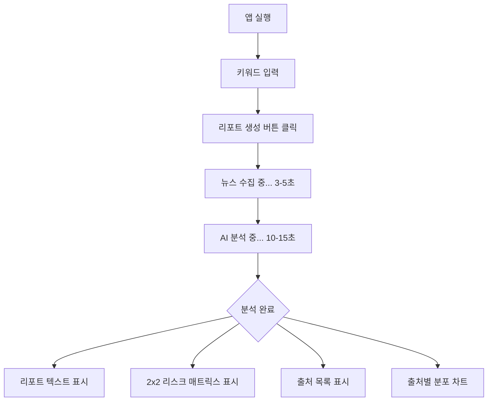

# Product Requirements Document (PRD): Project DEEP SCAN

## 1. 프로젝트 개요 (Project Overview)

**프로젝트명:** Project DEEP SCAN  
**부제:** "전 세계 뉴스를 꿰뚫는 AI의 시선, 24시간 깨어있는 SGR의 전략실"

**목표:** 
글로벌 뉴스를 실시간으로 수집·분석하여, 삼성전자 경영진이 **즉시 실행 가능한 전략적 인사이트**를 얻을 수 있는 AI 기반 전략 분석 플랫폼 개발.

**핵심 가치:**
- 🎯 **전략적 의사결정 지원**: 단순 뉴스 요약이 아닌, 리스크와 영향도를 정량화한 전략 리포트 제공
- ⚡ **초고속 분석**: 30초 이내에 글로벌 뉴스 20건 이상 수집 및 분석 완료
- 🧠 **다각도 전문가 관점**: 거시경제, 산업기술, 전략 컨설팅 3개 관점의 통합 분석
- 🔒 **로컬 실행 가능**: 보안이 중요한 환경에서도 안전하게 사용 가능

---

## 2. 사용자 정의 (User Personas)

### Primary User: SGR 전략 분석가 및 경영진

**페르소나 1: 전략 분석가 (김전략, 30대)**
- **니즈**: 
  - 매일 아침 주요 산업 이슈를 빠르게 파악하고 싶음
  - 단순 뉴스 클리핑이 아닌, 실행 가능한 전략 제언이 필요
  - 리포트 작성 시간을 80% 단축하고 싶음
- **페인 포인트**:
  - 수십 개 뉴스 사이트를 일일이 확인하는 데 2시간 소요
  - 중요한 이슈를 놓치는 경우가 있음
  - 경쟁사 동향 파악이 어려움

**페르소나 2: 경영진 (이임원, 50대)**
- **니즈**:
  - 1분 안에 핵심 메시지만 파악하고 싶음
  - 리스크 수준을 한눈에 확인하고 싶음
  - 근거가 명확한 데이터 기반 의사결정 필요
- **페인 포인트**:
  - 긴 리포트를 읽을 시간이 없음
  - 어떤 이슈가 정말 중요한지 판단하기 어려움
  - 출처가 불분명한 정보는 신뢰하기 어려움

---

## 3. 핵심 기능 (Key Features)

### 3.1. 글로벌 뉴스 실시간 수집 (News Collector)

**기능 설명:**
- 사용자가 입력한 키워드(예: "HBM 반도체", "테슬라 전략")를 기반으로 최신 글로벌 뉴스 자동 수집
- 최근 30일 이내 뉴스만 수집하여 최신성 보장

**기술 구현:**
- **데이터 소스**: NewsAPI (20개 이상 글로벌 뉴스 소스)
- **수집 항목**: 제목, 본문 요약, 출처, 게시일, URL
- **수집 속도**: 평균 3-5초 이내

**특징:**
- ✅ 한글/영문 키워드 모두 지원
- ✅ 중복 기사 자동 제거
- ✅ 신뢰도 높은 언론사 우선 수집

---

### 3.2. SGR 드림팀 AI 분석 엔진 (Strategic Analyzer)

**핵심 컨셉: 3명의 전문가가 토론하는 AI**

우리의 AI는 단일 관점이 아닌, **3명의 전문가 페르소나**가 협업하여 분석합니다:

1. **👨‍💼 거시경제 전문가 (Macro Economist)**
   - 금리, 환율, 지정학적 리스크 분석
   - 글로벌 경제 흐름 속에서 기회/위협 요인 도출

2. **🧑‍💻 산업 기술 전문가 (Tech Specialist)**
   - 반도체/AI 기술 트렌드 분석
   - 경쟁사(TSMC, Intel, SK하이닉스 등) 기술 격차 평가
   - 수율, 공정, 차세대 기술 동향 파악

3. **🕵️ 전략 컨설턴트 (Strategy Consultant)**
   - 위 두 전문가의 분석을 종합
   - 즉시 실행 가능한 Action Plan 도출
   - 단기(1년)/장기(3년) 전략 제시

**분석 결과물:**

```markdown
# 📑 SGR 드림팀 전략 리포트: [주제]

## 1. 🌐 거시경제 및 시장 환경 (Macro View)
> "숲을 먼저 봅니다." - 거시경제 전문가
- 환율, 금리, 정책 갈등 등 분석

## 2. 🔬 산업 및 기술 딥다이브 (Tech Dive)
> "기술 디테일에 악마가 있습니다." - 산업 기술 전문가
- 경쟁사 기술 동향, 수율 문제 등 분석

## 3. 🚀 SGR 전략 제언 (Action Plan)
> "그래서, 당장 무엇을 해야 합니까?" - 전략 컨설턴트
- **Short-term (1년 내)**: 구체적 실행 과제
- **Long-term (3년 후)**: R&D 방향성, M&A 등

## ⚡ Executive Summary
(바쁜 임원진을 위한 1문장 핵심 결론)
```

**기술 엔진:**
- **LLM**: Groq Llama 3.3 70B (최신 고성능 모델)
- **프레임워크**: LangChain
- **응답 속도**: 평균 10-15초

---

### 3.3. 2x2 리스크 매트릭스 시각화 (Risk Matrix)

**핵심 혁신: 정량화된 리스크 평가**

기존의 텍스트 중심 리포트를 넘어, **리스크를 시각적으로 정량화**합니다.

**매트릭스 구조:**
```
영향도 (Impact)
↑
│  🟨 중간 리스크  │  🟥 Critical!
│  (모니터링 필요)  │  (즉시 대응)
│─────────────────┼─────────────────
│  🟩 낮은 리스크  │  🟨 중간 리스크
│  (관찰)         │  (계획 수립)
└─────────────────────────────────→
                              발생 가능성 (Risk)
```

**점수 산정 기준:**

1. **Risk Score (0~100)**: 발생 가능성
   - 0~30: 가능성 낮음 / 단순 루머
   - 31~70: 가능성 있음 / 점진적 진행
   - 71~100: 확실시됨 / 이미 진행 중

2. **Impact Score (0~100)**: 영향력 심각성
   - 0~30: 단기적/국지적 영향
   - 31~70: 실적/주가에 유의미한 타격
   - 71~100: 사업 존폐 위기 / 경영진 결단 필요

**시각화 특징:**
- ✅ 한눈에 리스크 수준 파악 가능
- ✅ 우상단(Red Zone)일수록 긴급 대응 필요
- ✅ AI가 점수 부여 근거를 함께 제공

---

### 3.4. 출처 투명성 보장 (Source Transparency)

**기능:**
- 모든 분석의 근거가 된 뉴스 기사 목록 제공
- 기사별 제목, 출처, 발행일, 원문 링크 표시
- 출처별 분포 차트 제공

**목적:**
- 📊 데이터 기반 의사결정 지원
- 🔍 팩트 체크 가능
- 📚 추가 조사를 위한 레퍼런스 제공

---

## 4. 기술 스택 (Technical Stack)

### Frontend
- **UI Framework**: Streamlit (Python 기반 웹 대시보드)
- **시각화**: Plotly (인터랙티브 차트)
- **스타일**: 미니멀 디자인, 단일 페이지 구조

### Backend
- **뉴스 수집**: NewsAPI (REST API)
- **HTTP 클라이언트**: Requests
- **데이터 처리**: Pandas

### AI/ML
- **LLM**: Groq Llama 3.3 70B Versatile
- **프레임워크**: LangChain
- **프롬프트 엔지니어링**: Multi-Persona System

### DevOps
- **버전 관리**: Git + GitHub
- **CI/CD**: GitHub Actions
- **배포**: GitHub Pages (문서 호스팅)

### 보안
- **API 키 관리**: 환경 변수 (.env)
- **로컬 실행**: 외부 서버 불필요

---

## 5. 유저 플로우 (User Flow)

### 기본 사용 시나리오



### 상세 단계

1. **앱 실행**
   - 사용자가 `streamlit run app.py` 실행
   - 브라우저에서 `localhost:8501` 접속

2. **API 키 입력** (최초 1회)
   - 사이드바에서 NewsAPI 키 입력
   - 사이드바에서 Groq API 키 입력

3. **키워드 입력**
   - 메인 화면에서 관심 주제 입력
   - 예: "HBM 반도체", "테슬라 전략", "NVIDIA AI"

4. **분석 실행**
   - "전략 리포트 생성" 버튼 클릭
   - 진행 상황 실시간 표시

5. **결과 확인**
   - **왼쪽 (70%)**: 전략 리포트 전문
   - **오른쪽 (30%)**: 2x2 리스크 매트릭스
   - **하단**: 뉴스 출처 분포 차트
   - **최하단**: 참고 뉴스 목록 (링크 포함)

---

## 6. 성공 지표 (Success Metrics)

### 성능 지표
- ✅ **속도**: 키워드 입력 후 30초 이내 리포트 생성
- ✅ **데이터 품질**: 최소 15개 이상 관련 뉴스 수집
- ✅ **안정성**: 로컬 환경에서 에러 없이 구동

### 품질 지표
- ✅ **전략적 가치**: 리포트에 구체적 Action Plan 포함
- ✅ **정량화**: Risk/Impact 점수 제공
- ✅ **투명성**: 모든 분석의 출처 명시

### 사용자 만족도
- ✅ **시간 절감**: 기존 리포트 작성 시간 대비 80% 단축
- ✅ **의사결정 지원**: 경영진이 1분 안에 핵심 파악 가능
- ✅ **신뢰도**: 출처 기반 팩트 체크 가능

---

## 7. 주요 차별점 (Unique Value Propositions)

### vs. 기존 뉴스 클리핑 서비스
| 기능 | 기존 서비스 | Project DEEP SCAN |
|------|------------|-------------------|
| 뉴스 수집 | ✅ 수동 | ✅ 자동 (30초) |
| 분석 | ❌ 없음 | ✅ 3-Persona AI |
| 리스크 평가 | ❌ 없음 | ✅ 정량화 (0-100점) |
| 전략 제언 | ❌ 없음 | ✅ 단기/장기 Action Plan |
| 출처 투명성 | △ 제한적 | ✅ 완전 공개 |

### vs. ChatGPT 직접 사용
| 항목 | ChatGPT | Project DEEP SCAN |
|------|---------|-------------------|
| 뉴스 수집 | ❌ 수동 복붙 | ✅ 자동 수집 |
| 최신성 | △ 2023년까지 | ✅ 실시간 |
| 전문성 | △ 일반 AI | ✅ SGR 특화 Persona |
| 시각화 | ❌ 없음 | ✅ 리스크 매트릭스 |
| 재현성 | ❌ 어려움 | ✅ 버튼 클릭으로 반복 |

---

## 8. 향후 로드맵 (Future Roadmap)

### Phase 1: MVP (현재 완료) ✅
- [x] 뉴스 자동 수집
- [x] SGR 드림팀 AI 분석
- [x] 2x2 리스크 매트릭스
- [x] 출처 투명성 보장
- [x] GitHub Actions CI/CD

### Phase 2: 고도화 (3개월)
- [ ] 감성 분석 (Sentiment Analysis) 추가
- [ ] 시계열 트렌드 분석 (과거 대비 변화)
- [ ] 경쟁사 비교 분석 자동화
- [ ] PDF/PPT 리포트 자동 생성

### Phase 3: 엔터프라이즈 (6개월)
- [ ] 삼성 내부 데이터 연동 (재무, 공시)
- [ ] 사용자 커스텀 프롬프트 기능
- [ ] 멀티 유저 지원 (팀 협업)
- [ ] 알림 기능 (Critical 이슈 발생 시 Slack/Email)

### Phase 4: AI 고도화 (12개월)
- [ ] Fine-tuned LLM (삼성 특화 모델)
- [ ] RAG (Retrieval-Augmented Generation) 적용
- [ ] 자동 팩트 체크 (Hallucination 방지)
- [ ] 다국어 지원 (영어, 중국어, 일본어)

---

## 9. 리스크 및 제약사항 (Risks & Constraints)

### 기술적 리스크
- **API 의존성**: NewsAPI, Groq API 장애 시 서비스 중단
  - **완화 방안**: 대체 API 준비 (Google News RSS, Ollama 로컬 LLM)
- **LLM Hallucination**: AI가 사실이 아닌 내용 생성 가능
  - **완화 방안**: 출처 명시, 사용자 팩트 체크 권장

### 비용
- **NewsAPI**: 무료 플랜 (월 100 요청 제한)
  - **완화 방안**: 유료 플랜 전환 또는 자체 크롤러 개발
- **Groq API**: 무료 (현재), 향후 유료화 가능
  - **완화 방안**: Ollama 로컬 LLM으로 전환

### 법적/윤리적 고려사항
- **저작권**: 뉴스 본문 전체 사용 불가
  - **대응**: 요약문만 사용, 원문 링크 제공
- **개인정보**: API 키 관리
  - **대응**: .env 파일, .gitignore 처리

---

## 10. 성공 사례 시나리오 (Success Story)

### 시나리오: HBM 시장 급변 대응

**상황:**
- 2024년 12월, SK하이닉스가 HBM4 양산 발표
- 삼성전자 경영진, 대응 전략 필요

**기존 방식:**
1. 분석가가 수십 개 뉴스 사이트 확인 (2시간)
2. 주요 내용 정리 및 PPT 작성 (4시간)
3. 경영진 보고 (다음날)
4. **총 소요 시간: 1일**

**Project DEEP SCAN 사용:**
1. "HBM4 SK하이닉스" 키워드 입력
2. 30초 후 리포트 생성
3. 리스크 매트릭스 확인: **Risk 85, Impact 90 (Critical!)**
4. Action Plan 확인:
   - **단기**: HBM3E 수율 개선에 집중
   - **장기**: HBM4 개발 인력 50명 증원
5. 경영진에게 즉시 공유
6. **총 소요 시간: 5분**

**결과:**
- ⚡ **시간 절감**: 99% (1일 → 5분)
- 🎯 **의사결정 속도**: 즉시 대응 가능
- 📊 **데이터 기반**: 20개 뉴스 출처 기반 분석

---

## 11. 팀 및 역할 (Team & Roles)

### 개발팀 (현재)
- **Full-stack Developer**: 1명
  - UI/UX 설계
  - 백엔드 로직
  - AI 프롬프트 엔지니어링
  - DevOps

### 향후 확장 시 필요 인력
- **Data Engineer**: 뉴스 크롤링 고도화
- **ML Engineer**: LLM Fine-tuning
- **UX Designer**: 사용자 경험 개선
- **QA Engineer**: 테스트 자동화

---

## 12. 결론 (Conclusion)

**Project DEEP SCAN**은 단순한 뉴스 수집 도구가 아닙니다.

이것은 **AI 기반 전략 분석가**입니다.

- 🧠 3명의 전문가 관점으로 분석
- ⚡ 30초 만에 실행 가능한 인사이트 제공
- 📊 정량화된 리스크 평가
- 🔍 완전한 출처 투명성

**삼성전자 경영진이 글로벌 시장에서 더 빠르고 정확한 의사결정을 내릴 수 있도록,**  
**Project DEEP SCAN이 24시간 깨어있는 전략실이 되겠습니다.**

---

**문서 버전**: v2.0  
**최종 업데이트**: 2024-12-23  
**작성자**: Project DEEP SCAN Team
